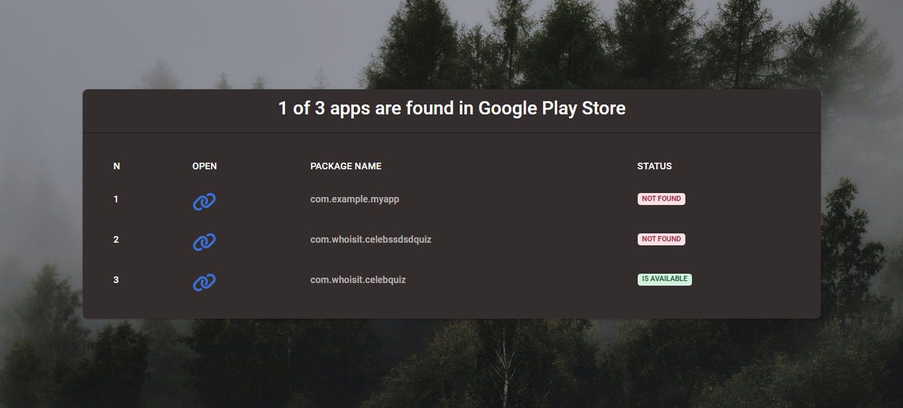

# Documentation Detective Apiwi

## NOTE ##
- If you do not have these libraries ("webbrowser,urllib.request"), you can install them with this command

`pip install -r requirements.txt`

## Method @1
- To execute a script without clicking a shell file, you can use this command.

`python check.py package_list.txt`

## Method @2
##### windows
- By clicking on the file `run_script_in_windows.bat`, you can execute a script using a shell.

##### macOS
- Executing a script on a macOS might require approval from the system as it could be viewed as a virus. However, you can follow these steps to run the program:

--- SOURCE *CHATGPT* ---
To execute a Python script on click in the Finder on macOS, you can create an AppleScript or shell script that runs the Python script and associate it with the file type. Here's an example of how to do this:

1 - Create a new shell script with a name like `run_script_in_macOS.sh`. You can do this by opening a text editor like TextEdit, typing the following commands, and saving the file with a .sh extension:

*******************************
#!/bin/bash
python /path/to/your/script.py
*******************************

2 - Replace `/path/to/your/script.py` with the actual path to your Python script.
Make the shell script executable by running the following command in Terminal:

********************************************
chmod +x /path/to/your/run_script_in_macOS.sh
********************************************

This will give the shell script execute permissions.

3 - Create a new AppleScript by opening the AppleScript Editor (found in the Applications > Utilities folder) and typing the following commands:

*********************************************************************************************
on open these_items
    repeat with this_item in these_items
        set the item_info to info for this_item
        if the name extension of the item_info is "py" then
            do shell script `/path/to/your/run_script_in_macOS.sh` & POSIX path of this_item
        end if
    end repeat
end open
*********************************************************************************************

Replace `/path/to/your/run_script_in_macOS.sh` with the actual path to your shell script.

4 - Save the AppleScript as an application by choosing "File > Save As" and selecting "Application" as the file format.

5 - Associate the new application with Python script files by right-clicking on a Python script file in Finder, selecting "Get Info", and changing the "Open with" setting to the new application.

Now, when you double-click on a Python script file in Finder, it will execute the shell script, which in turn runs the Python script.